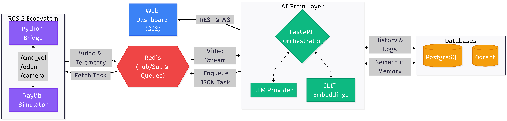

# Semantic Fleet Brain & Autonomous Drone Simulator

An advanced, real-time autonomous robotics framework bridging the gap between high-level human reasoning and low-level robotic control. This project combines **Large Language Models (LLMs)**, **Vision-Language Models (CLIP)**, and **ROS 2** to enable an autonomous drone to explore unknown environments, build a semantic-spatial memory map, and execute complex natural language commands using real-time **Visual Servoing**.

## Key Features

* **LLM-powered task planning:** Parses complex, unstructured human instructions (e.g., *"Find where the charger is and go there"*) and decomposes them into a structured JSON execution plan containing actions like `EXPLORE`, `NAVIGATE`, or `SEARCH`.

* **Semantic spatial memory (RAG for robotics):** During the exploration phase, the drone captures real-time video frames, processes them through OpenAI's **CLIP** model to extract multi-modal embeddings, and indexes them inside a **Qdrant Vector Database** mapped with their exact 3D spatial coordinates `[X, Y, Z, Yaw]`.

* **Closed-loop visual servoing:** When navigating to a semantic object, the drone uses spatial database coordinates to fly close to the target, and then seamlessly hands over control to an OpenCV-based proportional controller to visually center, track, and approach the object dynamically.

* **Custom lightweight 3D simulator:** Built from scratch in C++ using **Raylib** and **rlgl**. It features a full 6DOF drone physics model, dual-camera rendering (FPV for the drone, Free Camera for the operator), dynamic JSON world configuration, and smart rendering masks to hide debug gizmos from the drone's sensory camera.

* **Visual world builder**: A custom Tkinter-based GUI allows you to visually design 3D environments. Place walls and objects on a 2D grid, customize shapes and colors using an integrated HSV picker, and export directly as a JSON file for immediate use in the simulator.

* **Ground Control Station (GCS):** A sleek, dual-pane web dashboard with dark-mode support. It establishes an ultra-low latency WebSocket connection to stream real-time FPV video processed via Redis, monitor live AI system logs, and dispatch missions instantly.

* **Containerized development environment:** Fully isolated environment via **DevContainers** with NVIDIA GPU support for high-performance AI inference.

## System Architecture

The project is highly modular, employing **Redis** as a real-time message broker and queue manager to decouple heavy AI inference (LLM & CLIP) from the high-frequency real-time ROS 2 control loop.



### 1. The AI brain (`main.py`)

A fast, asynchronous **FastAPI** orchestration layer:

* **LLM Router:** Routes natural language inputs to Gemini or Ollama, generating structured flight logs and execution plans.
* **Semantic Resolver:** Translates semantic queries (e.g., *"the purple sphere"*) into concrete physical vectors `[X, Y, Z, Yaw]` by querying the Qdrant vector database using text-embeddings.
* **Memory Reset API:** Provides a clean interface to completely wipe the spatial database and empty Redis queues to start a clean mission when environments or objects shift.

### 2. The ROS 2 bridge (`redis_bridge_node.py`)

A robust Python ROS 2 node managing active missions:

* Subscribes to the Redis Task Queue to fetch the active step-by-step plan.
* Monitors the drone's FPV feed (`/camera/image_raw/compressed`), runs real-time HSV masking, and extracts object centroids.
* Implements the **Visual Servoing** routine: actively adjusting linear velocities and angular yaw based on pixel error margins to center the target perfectly.
* Encodes and publishes the final annotated video stream directly back to Redis on a dedicated `live_video_stream` pub/sub channel.

### 3. The 3D simulator (`simulator_node.cpp`)

A lightweight, fast C++ executable built using **Raylib** and **ROS 2**:

* Computes complex 6DOF rigid body kinematics, reacting dynamically to `/cmd_vel` inputs.
* Publishes high-frequency ground-truth Odometry (`/odom`).
* Features **Render Isolation**: draws visual helpers and coordinates axes in the Free view for the operator, but excludes them from the drone's FPV frame, avoiding false-positive color detections during HSV masking.

### 4. World builder (`world_builder.py`)

A standalone Tkinter-based application that accelerates scene design.

* **Key capabilities**: Visual grid editing, shape management (cube, sphere, cylinder, etc.), HSV color picker, and automated coordinate mapping (2D grid to 3D Cartesian space) exported as JSON.

### 5. GCS web dashboard (`index.html`)

The operator's flight deck:

* Streamlined split-screen layout displaying the live camera feed and a styled terminal side-by-side.
* Embedded robust auto-reconnecting WebSocket engine keeping the video stream alive even through server/bridge hot-reloads.
* Controls to wipe memory, toggle active LLM providers, and fetch PostgreSQL historical logs.


### 6. Containerized development environment

The project provides a fully pre-configured development environment via **VS Code DevContainers**. This ensures identical environments across machines with full access to NVIDIA GPUs for AI acceleration.

### Setup
1. **Prerequisites:** Install [Docker Desktop](https://www.docker.com/products/docker-desktop/) and the "Dev Containers" extension in VS Code.
2. Open the project folder in VS Code.
3. Press F1 (or Ctrl+Shift+P / Cmd+Shift+P) to open the Command Palette.
4. Type and select "Dev Containers: Open Folder in Container...".
5. Select the root folder of the project from the file picker.

VS Code will build the Docker image and start the container automatically.
3. **Environment:** The `postCreateCommand` in `devcontainer.json` will automatically sync all Python dependencies via `uv`.

### Infrastructure services
The `compose.yaml` automatically manages the backend infrastructure:
* **PostgreSQL:** Stores mission history and logs.
* **Qdrant:** Vector database for semantic spatial memory.
* **Redis:** Real-time message broker for Task Queues and Live Video Streams.

## Tech stack

* **Robotics:** ROS 2 (Jazzy), C++, Python
* **AI & Machine Learning:** OpenAI CLIP, Google Gemini API, Ollama (Local LLM)
* **Databases:** Qdrant (Vector DB), Redis (In-Memory Queue & Stream), PostgreSQL (History Engine)
* **Computer Vision & Rendering:** Raylib, rlgl, OpenCV, `cv_bridge`, `image_transport`
* **Web Frontend:** HTML5, CSS Variables, Modern JavaScript (WebSockets)

## Getting Started

1. **Spin up infrastructure:** Ensure Qdrant (port 6333), Redis (port 6379), and PostgreSQL are running.

2. **Build the ROS 2 workspace:**

```bash
ros2init
colcon build --symlink-install
source install/local_setup.zsh
```

3. **Run simulation & bridge:**

```bash
ros2init
ros2 launch fleet_brain_bringup simulator.launch.py
```

4. **Launch AI backend:**

```bash
cd src/api
uv run uvicorn main:app
```

5. **Open GCS:** Open `http://localhost:8000` in your web browser, and start commanding your drone.
